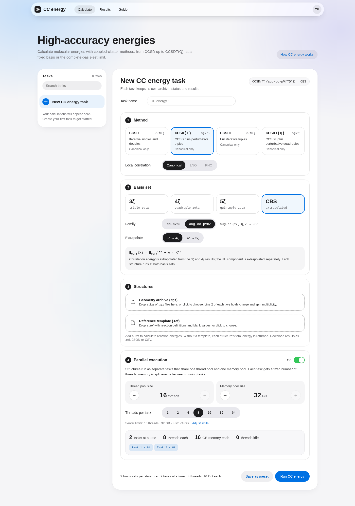

# Energyhub

**上传分子结构和参考值模板，得到可以直接交给 DFThub 的参考能量文件。**

Energyhub 是一个用 PySCF 做耦合簇计算的 Python 包，附带浏览器界面和 HTTP API。选择方法、基组和计算资源后，可以查看任务进度、终止计算、下载完整 `.ref`，也可以检查每个分子的能量分量与每条反应的结果。前端随 Python 包安装，不需要 Node.js 或单独的前端服务。



## 安装并打开界面

需要 **Python 3.10+**，支持 Linux 和 macOS；Windows 请使用 WSL2。建议在独立虚拟环境中安装：

```bash
git clone git@github.com:chen-yu-hao/Energyhub.git
cd Energyhub
python3 -m venv .venv
source .venv/bin/activate
python -m pip install '.[all]'
energyhub doctor
energyhub serve
```

打开 **http://127.0.0.1:2022**。`.[all]` 安装 Flask 和 PySCF 2.14+；界面所有资源都在包内，运行时不需要 CDN。

如果已经有 PySCF 环境，直接复用它即可：

```bash
python -m pip install '.[api]'
export ENERGYHUB_PYTHON=/path/to/pyscf-environment/bin/python
energyhub doctor
energyhub serve --data-dir ./energyhub-data
```

`ENERGYHUB_PYTHON` 应指向 Python 可执行文件。也可以在命令行加 `--python /path/to/python`。未指定时，程序会查找当前 Python、PATH 和相邻 Conda 环境中的 PySCF，优先选择 2.14 或更新版本。它不会修改已有计算环境。

## 第一次计算

1. 在 **New CC energy task** 中填写任务名称，选择方法和基组。
2. 上传包含 XYZ 文件的 `.tgz`。需要反应参考值时，使用独立的 `.ref` 上传区；不提供模板时计算各结构总能。
3. 设置线程池、每个分子的线程数和内存预算，点击 **Run calculation**。
4. 在左侧选择任务查看进度；完成后下载 `.ref`、JSON 报告或 CSV。

仓库附带可以直接运行的 [H₂ 几何归档](examples/H2.tgz) 和 [参考值模板](examples/H2.ref)，界面的 Guide 也提供下载。示例计算两种 H–H 距离之间的电子能差；它用于检查安装与数据流程。

任务列表来自服务端，刷新浏览器或重新启动服务后仍可看到历史结果。正在运行的任务可以终止；未全部成功的计算不会提供完整 `.ref` 下载。重启服务会把未完成任务标为失败，不会自动重做昂贵计算。

## 可以计算什么

| 方法 | 闭壳层 RHF | 开壳层 UHF |
| --- | --- | --- |
| CCSD | 支持 | 支持 |
| CCSD(T) | 支持 | 支持 |
| CCSDT | 支持 | 支持 |
| CCSDT(Q) | PySCF 2.14+ 支持 | 当前 PySCF 尚未实现 |

程序检查实际环境的方法能力。不可用的方法会给出原因，不能用别的方法冒充。`CCSDT(Q)` 使用 PySCF 返回的 `(Q)` 修正，不是完整迭代 `CCSDTQ`，也不会把 `[Q]` 和 `(Q)` 两项重复相加。

基组选择包括：

- **3ζ、4ζ、5ζ**：`cc-pVTZ`、`cc-pVQZ`、`cc-pV5Z`。
- **增广基组**：对应的 `aug-cc-pVnZ`。
- **CBS**：3ζ/4ζ 或 4ζ/5ζ 两点外推，支持普通和增广基组。

界面中的 LNO/PNO 显示为不可用，因为目前没有接入经过验证的局域耦合簇后端。当前执行的是 canonical CC。

默认关联全部电子，使用全电子基组；不自动替换 ECP。没有加入零点能、热力学、相对论或自旋轨道修正。结果是所选电子结构模型下的电子能。

SCF 收敛阈值为 `1e-10 Eh`；CC 能量阈值为 `1e-9 Eh`，振幅阈值为 `1e-7`。任何必要计算未收敛，整个任务都会失败。

CBS 分别外推 HF 与相关能。对于相邻基组级别 `L`、`H`：

```text
HF∞   = (HF_H − exp(−1.63 × (H−L)) × HF_L) / (1 − exp(−1.63 × (H−L)))
Corr∞ = (H³ × Corr_H − L³ × Corr_L) / (H³ − L³)
E∞    = HF∞ + Corr∞
```

报告保留两套有限基组结果、PySCF 版本、修正项和外推参数，方便核查。

## 准备 DFThub 输入

`.tgz` 可以包含子目录，但每个 XYZ 的文件名去掉扩展名后必须唯一。坐标单位为 Å；第二行必须写整数电荷与自旋多重度：

```text
2
0 1
H 0 0 0
H 0 0 0.74
```

`.ref` 每行先写若干 `系数 分子名` 对，再写参考值和可选的归一化因子。用 `?` 表示需要计算的值：

```text
-1 ethene -1 butadiene 1 P1 ? 1
1 conformer_B -1 conformer_A ?
```

第一行带末尾因子，输出单位为 **kcal/mol**；第二行不带因子，输出单位为 **Hartree**。`P1` 也是分子名，需要对应的 `P1.xyz`。

有归一化因子时，`.ref` 存储的仍是完整反应能，**不会先除以该因子**。这样 DFThub 在后续评估时只归一化一次。换算沿用 DFThub 的 `627.509 kcal/mol/Eh`。

也接受 `NA`、`null` 和明确的空 tab 字段；推荐使用 `?`，避免空白列歧义。零字节 `.ref` 会为每个分子生成一条总能记录。已有参考数值会被重新计算，输入文件本身不被覆盖。

## 资源、队列与终止

服务默认使用 **自动检测**：持续读取当前服务器可用 CPU、总内存、可用内存和容器内存限制。资源探测最多缓存 2 秒，网页约每 3.5 秒刷新一次；提交任务和排队调度也会检查资源，因此不需要一直打开网页。自动内存预算取当前容量与可用内存中较小值的约 80%，再向下取整；8 GB 仅是无法探测时的后备值。

资源下降时，已运行任务保留原有额度，调度器暂缓新任务；资源恢复后继续执行。页面分别显示实时可用内存、池额度和已预约资源。未经手动修改的任务输入会跟随服务器额度；已经编辑的值或上传文件不会被轮询覆盖，可点 **Use server values** 重新采用当前值。

在 **Resource settings** 中可切换自动检测和手动固定模式。自动模式只保存模式，不保存机器专属数字，迁移或重启后会重新探测。旧版保存的固定额度会作为手动模式保留；选择自动模式即可取消旧的固定额度。

自动启动：

```bash
energyhub serve --resources auto --data-dir ./energyhub-data
```

手动指定固定额度：

```bash
energyhub serve --resources manual \
  --thread-pool-size 16 \
  --pool-size 4 \
  --memory-pool-mb 16384 \
  --data-dir ./energyhub-data
```

- `thread-pool-size`：所有运行分子共享的 CPU 线程预算。
- `pool-size`：同时运行的分子数上限。
- `memory-pool-mb`：所有运行任务共享的内存预约预算。

新任务界面按设计显示 GB 内存步进器和每任务线程分段按钮，提交时自动将 GB 换算成 MB。线程池和每分子线程数决定并发数；界面会显示分配预览。调度器同时检查分子数、CPU 线程和内存，不够时排队。切换模式和修改手动额度需要队列空闲；自动模式的资源检查会在任务运行期间持续进行。显式指定固定池大小的启动参数会选择手动模式，不应与 `--resources auto` 同时使用。

内存数值最终交给 PySCF 的 `max_memory`；这是工作内存提示，不是操作系统的硬 RSS 限额。机器还需要为 Python、积分和数值库留出额外空间。

任务详情显示每个结构的排队/运行/完成状态、PID、SCF/CC/微扰修正阶段、当前 CBS 基组、耗时、线程数及内存预算（不是实时 RSS）。打开 **View log** 后会自动刷新日志，PySCF 输出按结构名标记并保存到任务目录的 `process.log`。任务完成后仍可查看进程记录和日志；旧版未记录的迭代日志无法恢复。

取消操作会停止整个任务进程组，包括分子计算子进程，然后释放资源预约。任务日志可在详情中查看。

## 命令行与 Python

不使用界面也能计算：

```bash
energyhub run examples/H2.tgz --ref examples/H2.ref \
  --output H2.completed.ref \
  --method 'CCSD(T)' --basis CBS --basis-family aug --cbs-pair 34 \
  --pool-size 2 --task-threads 2 --memory-pool-mb 4096
```

```python
from Energyhub import compute_reference

report = compute_reference(
    "dataset.tgz", "dataset.ref", "dataset.completed.ref",
    method="CCSD(T)", basis="CBS", basis_family="aug", cbs_pair="34",
    pool_size=2, task_threads=2, memory_pool_mb=4096,
)
print(report.to_dict())
```

通过 `progress=` 接收进度事件；通过 `cancel_event=threading.Event()` 取消库调用。单独的 Python/CLI 计算不属于正在运行的 Web 队列，应自行给它预留资源。

## HTTP API

前端与 API 默认同源，接口前缀为 `/api/energyhub`：

| 请求 | 用途 |
| --- | --- |
| `GET /methods` | 方法、基组和环境能力；`?refresh=1` 重新检查 |
| `GET /config` / `PUT /config` | 实时资源及自动/手动模式；`?refresh=1` 强制刷新，PUT `{"resource_mode":"auto"}` 启用自动检测 |
| `GET /jobs` | 任务历史，支持搜索与分页 |
| `POST /jobs` | 上传 `tgz`、`ref` 和计算选项，返回 `task_id` |
| `GET /jobs/{id}` | 状态、进度与结果摘要 |
| `POST /jobs/{id}/cancel` | 终止任务 |
| `GET /jobs/{id}/result` | 下载完整 `.ref` |
| `GET /jobs/{id}/report` | 完整能量报告 |
| `GET /jobs/{id}/log` | 最近日志 |

例如：

```bash
curl -F name='H2 reference' \
  -F tgz=@examples/H2.tgz -F ref=@examples/H2.ref \
  -F 'method=CCSD(T)' -F basis=3zeta -F basis_family=cc \
  -F pool_size=1 -F task_threads=2 -F memory_pool_mb=2048 \
  http://127.0.0.1:2022/api/energyhub/jobs
```

浏览器示例在 [examples/client.js](examples/client.js)。

## 搬到另一台机器

可以从源码安装，也可以构建 wheel 后复制过去：

```bash
python -m pip install build
python -m build
# 将 dist 中的 wheel 复制到目标机器，然后：
python -m pip install 'dfthub_energyhub-0.2.4-py3-none-any.whl[all]'
energyhub doctor
energyhub serve --data-dir /path/to/energyhub-data
```

需要保留任务历史时，先停止服务，再复制整个数据目录。默认位置是 `$XDG_DATA_HOME/energyhub`，未设置时为 `~/.local/share/energyhub`；可用 `--data-dir` 或 `ENERGYHUB_DATA_DIR` 指定。数据写入位置与安装位置分离，可以把 Python 包安装在只读目录。

部署时一个数据目录对应一个调度器进程。默认只监听本机；需要远程访问时可放在已有认证反向代理之后。这个项目不包含多用户账户系统。

## 开发和测试

```bash
python -m pip install -e '.[all]'
python -m unittest discover -s tests -p 'test_*.py' -v
```

测试覆盖 `.ref` 格式和单位、方法调度、非零 `(T)/(Q)` 修正、CBS、资源预算、取消与重启、前后端 API，以及移位后的 wheel 安装。真实计算测试使用小分子，仍需要可用的 PySCF 环境。

浏览器验证说明见 [tests/browser_smoke.py](tests/browser_smoke.py)。选择滑块、快速切换、减少动态效果以及 729px 控件布局另由 [tests/browser_interactions.py](tests/browser_interactions.py) 验证。CI 会运行测试并构建发行包。

自动资源的变化、任务预约保护与队列恢复由 `tests/test_dynamic_resources.py` 验证，页面轮询与输入保留由 `tests/browser_dynamic_resources.py` 验证。
